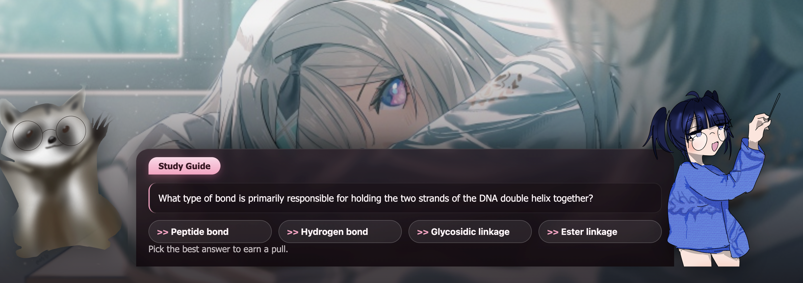

# gachavn
gacha visual novel!!! submit any study sheet and receive multiple choice questions to solve! and gamble your pulls away when you earn them from getting the questions correct :D

## screenshots




## web playable demo
A demo of the game is available online at https://gachavn-frontend.onrender.com/.

### backend setup
create and enter python virtual environment (for windows powershell, replace the second line with .venv\Scripts\Activate.ps1)
``` 
python -m venv .venv 
source .venv/bin/activate
```

inside virtual env,

``` pip install -r requirements.txt ```

and also make sure to set your gemini API key (navigate to https://aistudio.google.com/api-keys)

``` cp .env.example .env ```

and fill in the field in .env with your API key and run the backend now!!

``` python llm.py ```

### frontend setup
in another terminal instance, run the following commands to run the frontend!

```
npm install typescript
npm install -D vite
npm run dev
```
